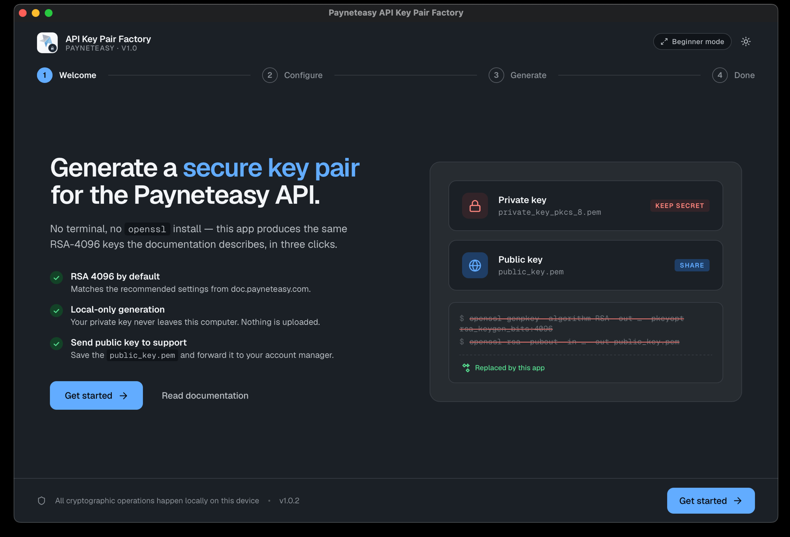
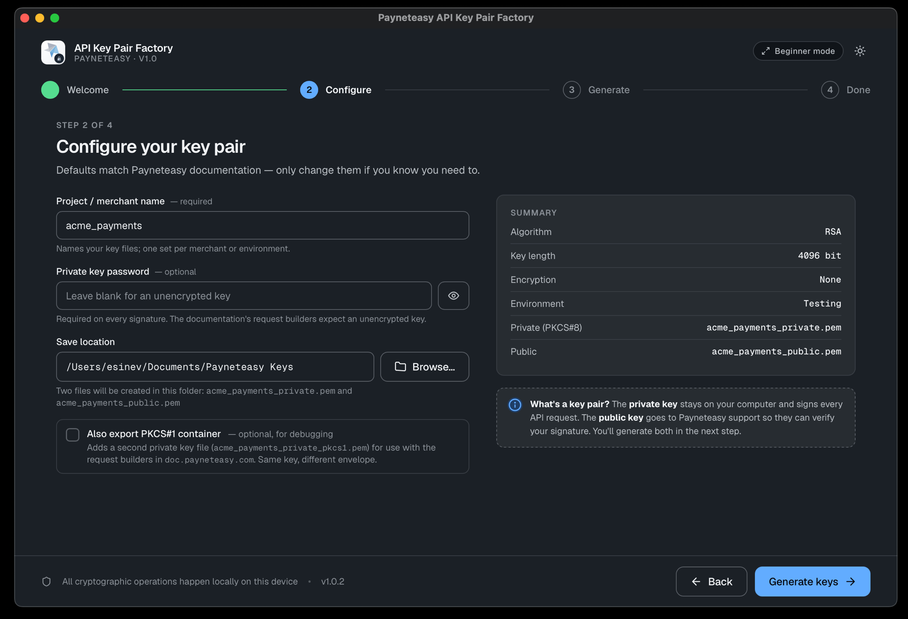
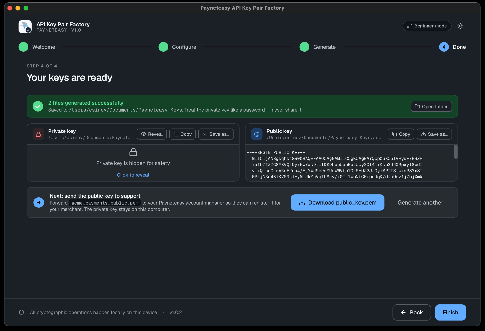

# Payneteasy API Key Pair Factory (Tauri 2 + React + Rust)

Native cross-platform desktop app that generates an RSA-4096 key pair (PKCS#8,
optional PKCS#1) for the Payneteasy API — a local, no-terminal replacement for
the OpenSSL CLI.

📲 **[Download on the Mac App Store](https://apps.apple.com/us/app/payneteasy-api-keypair-factory/id6775522326?mt=12)**

## Download

Pre-built installers are attached to every [GitHub release][releases]. Latest
(**1.0.1**):

| Platform | File |
|---|---|
| macOS | [`Payneteasy.API.Key.Pair.Factory_1.0.1_universal.dmg`](https://github.com/payneteasy/key-pair-factory/releases/download/1.0.1/Payneteasy.API.Key.Pair.Factory_1.0.1_universal.dmg) |
| Windows (installer) | [`Payneteasy.API.Key.Pair.Factory_1.0.1_x64-setup.exe`](https://github.com/payneteasy/key-pair-factory/releases/download/1.0.1/Payneteasy.API.Key.Pair.Factory_1.0.1_x64-setup.exe) |
| Windows (MSI) | [`Payneteasy.API.Key.Pair.Factory_1.0.1_x64_en-US.msi`](https://github.com/payneteasy/key-pair-factory/releases/download/1.0.1/Payneteasy.API.Key.Pair.Factory_1.0.1_x64_en-US.msi) |
| Windows (portable) | [`Payneteasy.API.Key.Pair.Factory_1.0.1.portable.exe`](https://github.com/payneteasy/key-pair-factory/releases/download/1.0.1/Payneteasy.API.Key.Pair.Factory_1.0.1.portable.exe) |
| Linux (AppImage) | [`Payneteasy.API.Key.Pair.Factory_1.0.1_amd64.AppImage`](https://github.com/payneteasy/key-pair-factory/releases/download/1.0.1/Payneteasy.API.Key.Pair.Factory_1.0.1_amd64.AppImage) |
| Linux (.deb) | [`Payneteasy.API.Key.Pair.Factory_1.0.1_amd64.deb`](https://github.com/payneteasy/key-pair-factory/releases/download/1.0.1/Payneteasy.API.Key.Pair.Factory_1.0.1_amd64.deb) |
| Linux (.rpm) | [`Payneteasy.API.Key.Pair.Factory-1.0.1-1.x86_64.rpm`](https://github.com/payneteasy/key-pair-factory/releases/download/1.0.1/Payneteasy.API.Key.Pair.Factory-1.0.1-1.x86_64.rpm) |
| Linux (Flatpak) | [`Payneteasy.API.Key.Pair.Factory_1.0.1.flatpak`](https://github.com/payneteasy/key-pair-factory/releases/download/1.0.1/Payneteasy.API.Key.Pair.Factory_1.0.1.flatpak) |
| Linux (binary) | [`Payneteasy.API.Key.Pair.Factory_1.0.1.linux.x64.bin`](https://github.com/payneteasy/key-pair-factory/releases/download/1.0.1/Payneteasy.API.Key.Pair.Factory_1.0.1.linux.x64.bin) |

[releases]: https://github.com/payneteasy/key-pair-factory/releases/latest

## What it's for

The Payneteasy API supports an **OAuth RSA-SHA256** request-authentication method
that requires merchants to provide an RSA public key. The official
[documentation][doc] walks you through generating the key pair by hand with
`openssl`:

```bash
# generate the PKCS#8 private key (RSA-4096)
openssl genpkey -algorithm RSA -out private_key_pkcs_8.pem -pkeyopt rsa_keygen_bits:4096
# derive the public key to send to support
openssl rsa -pubout -in private_key_pkcs_8.pem -out public_key.pem
# convert to a PKCS#1 container for the doc's request builders
openssl rsa -traditional -in private_key_pkcs_8.pem -out private_key_pkcs_1.pem
```

This app does exactly that — same algorithm, same key size, same PEM formats —
without a terminal or an OpenSSL install. Everything runs locally; the private
key never leaves your machine. Hand the generated `public_key.pem` to your
Payneteasy account manager and keep the private key for signing requests.

[doc]: https://doc.payneteasy.com/integration/general_api_usage/request_authentication_methods/oauth.html#oauth-rsa-sha256

## Screenshots

| Welcome | Configure | Done |
|---|---|---|
|  |  |  |

## Stack

| Layer | Choice |
|---|---|
| Shell | Tauri 2.x (native window, no Electron) |
| Frontend | React 18 + TypeScript (Vite) |
| Backend | Rust — all crypto + filesystem work |
| Crypto | `rsa`, `pkcs8` (PBES2 / AES-256-CBC), `pkcs1`, `rand` (`OsRng`), `zeroize` |
| Plugins | `dialog`, `opener`, `clipboard-manager`, `store` |

## Layout

```
├── src/                    # React frontend
│   ├── App.tsx             # 4-step wizard state machine + chrome
│   ├── ipc.ts              # typed wrappers around Tauri commands + plugins
│   ├── util.ts             # slug helper, shared types
│   ├── components/         # Stepper, KeyDisplay, icons
│   ├── screens/            # Welcome, Configure, Generate, Done
│   └── styles.css          # copied verbatim from the prototype
└── src-tauri/
    ├── src/
    │   ├── lib.rs          # Builder, command registration
    │   ├── keygen.rs       # RSA generation, PEM encoding, + unit tests
    │   ├── filesystem.rs   # atomic 0o600 writes, cleanup guard
    │   └── error.rs        # KeyGenError → { kind, message }
    ├── capabilities/       # plugin permission grants
    ├── icons/              # app icons (.png / .icns / .ico)
    └── tauri.conf.json
```

## Develop

```bash
npm install
npm run tauri dev          # launches the desktop app with HMR
```

## Build installers

```bash
npm run tauri build        # .dmg/.app (macOS), .msi (Windows), .deb/.rpm/.AppImage (Linux)
```

## Test

```bash
npm run build                       # typecheck + bundle the frontend
cd src-tauri && cargo test --lib    # crypto golden tests (PEM headers, bit length, encrypted round-trip)

# Rust lint (same checks as CI; toolchain pinned in src-tauri/rust-toolchain.toml)
cd src-tauri && cargo fmt --all -- --check
cd src-tauri && cargo clippy --all-targets --locked -- -D warnings
```

## Crypto contract

- RSA via `OsRng`; default **4096** bits (2048 / 3072 available in Advanced mode).
- Private container: **PKCS#8** PEM (`LF`). With a password → PKCS#8 **encrypted**
  (PBES2 + AES-256-CBC + HMAC-SHA-256).
- Optional companion: **PKCS#1** PEM (always unencrypted — for the doc request builders).
- Public key: **SPKI** PEM.
- Files: `{slug}{_prod?}_private.pem`, `{slug}{_prod?}_public.pem`,
  `{slug}{_prod?}_private_pkcs1.pem` — written atomically (temp → rename) with
  `0o600` permissions on Unix. Secret PEM buffers are zeroized after use.
- Fully offline — no network calls except the external "Read documentation" link.

## Notes / intentional choices

- The window uses `decorations: false` and renders the prototype's own framed
  card (title bar + theme toggle) so the app matches the handoff screenshots
  one-to-one. Resize/drag is wired through the title bar's drag region.
- Theme (light/dark) and detail mode (beginner/advanced) persist via
  `tauri-plugin-store`; first run defaults to the OS colour scheme.
- **Hardening TODO:** `app.security.csp` is currently `null` for dev convenience.
  For production, lock it to `default-src 'self'` and bundle the Geist fonts
  locally (replace the Google Fonts `@import` in `styles.css`) so the strict CSP
  needs no external `style-src`/`font-src`.
